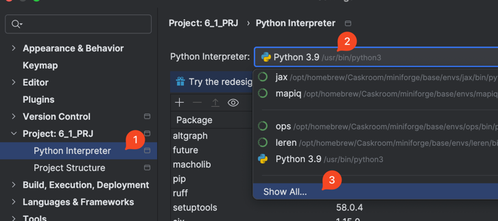
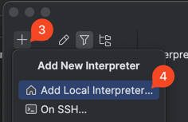
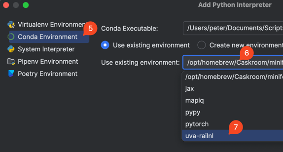
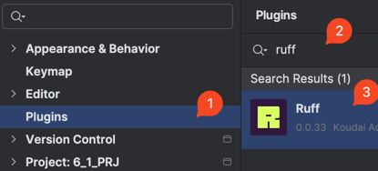
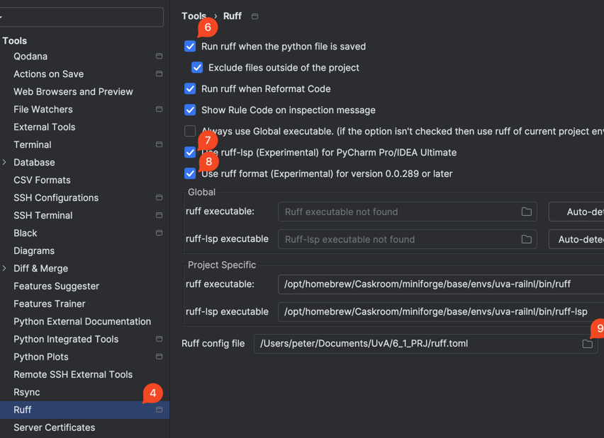
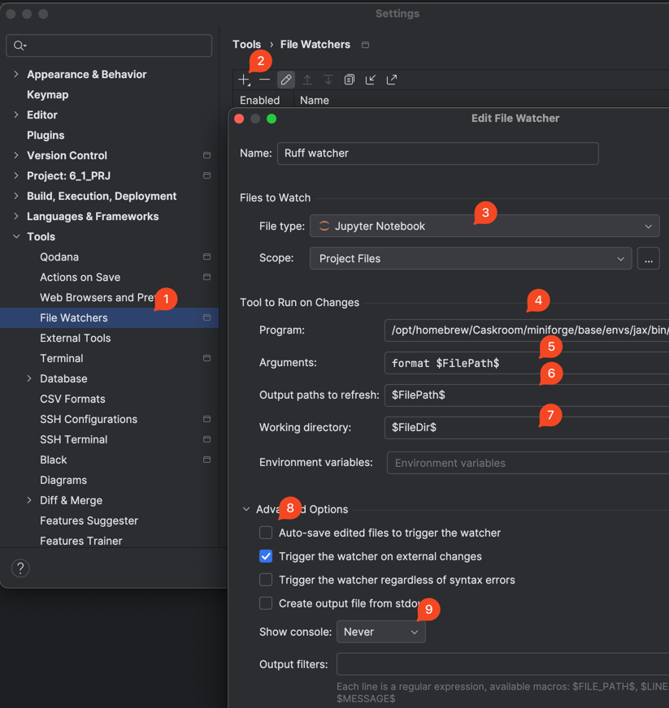

# uva-railnl

UvA KI project for RailNL

# Setup:

### Download the project:

1. Open the terminal to an appropriate directory, then clone the project
    ```shell
    mkdir railnl
    cd railnl
    git clone git@github.com:p-adema/uva-railnl.git
    ```
2. Create a virtual environment:
    ```shell
    conda create -n uva-railnl python=3.11 numpy polars[all] matplotlib pandas pyarrow jupyter jax keras ruff ruff-lsp
    ```

### Activate interpreter (PyCharm):

1. Go to interpreters <br>
   
2. Add a local interpreter <br>
   
3. Add the conda interpreter you just made <br>
   
4. Press OK<br>

### Setup formatter (PyCharm):

1. Install formatter plugin <br>
   
2. Enable formatter <br>
   
3. Find where the formatter is located <br>
    ```shell
    conda activate uva-railnl && which ruff
    ``` 
   e.g. `/opt/homebrew/Caskroom/miniforge/base/envs/uva-railnl/bin/ruff`
4. Add a file watcher for Jupyter Notebooks

   
5. If needed, go to Settings | Tools | Actions on Save > File Watcher and enable it
6. Verify it works: go to [parse](src/parse.ipynb), type
   ```python
   x = (1, 2,)
   ```
   Hit save: it should be reformatted to
   ```python
   x = (
       1,
       2,
   )
   ```

